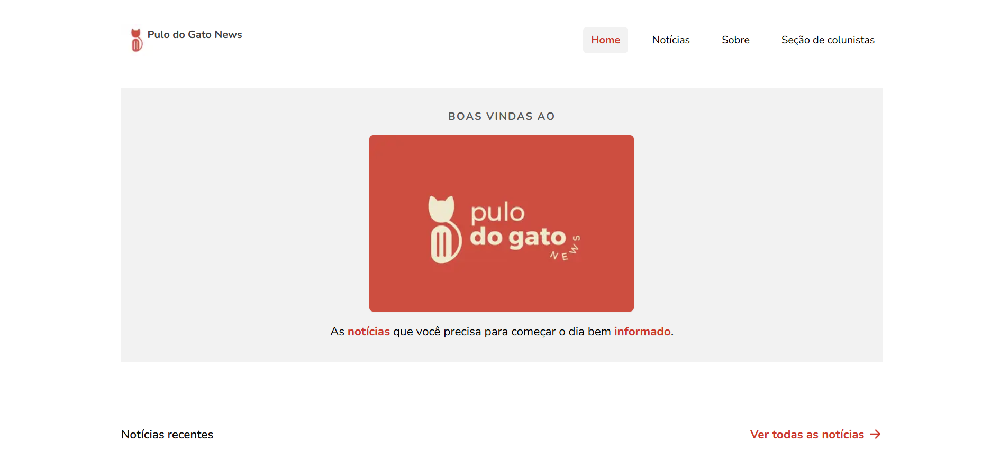
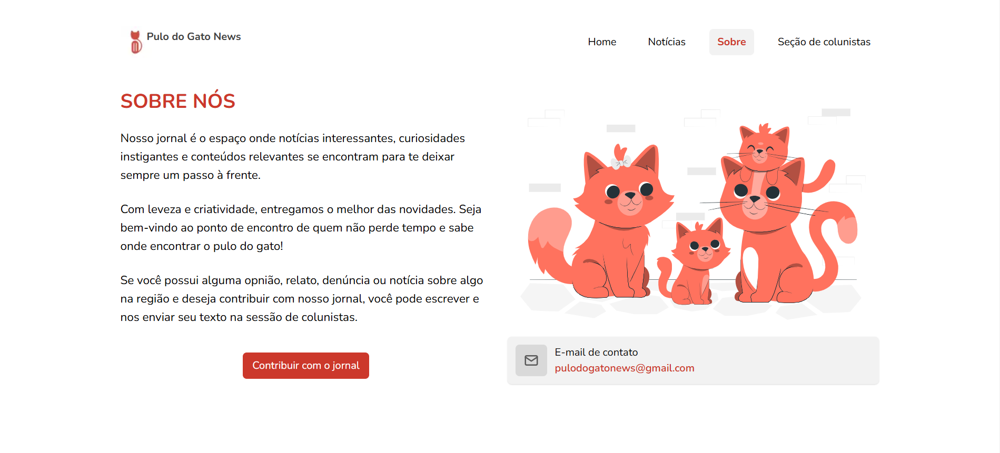
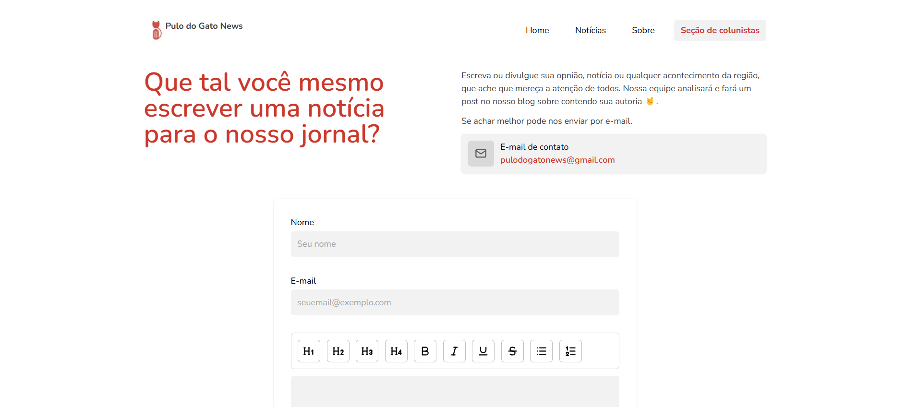
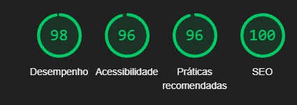

<div align="center">
  
</div>

<br />

<div align="center">
   <a href="https://github.com/JohnPetros">
      
   </a>
   
   <a href="https://github.com/JohnPetros/pulo-do-gato-news/commits/main">
      
   </a>
  </a>
   </a>
   <a href="https://github.com/JohnPetros/pulo-do-gato-news/blob/main/LICENSE.md">
      
   </a>
    
</div>
<br>

## 🖥️ Sobre o Projeto

**Pulo do Gato News** é um **blog** de notícias com foco na região de São Paulo,
tendo em seu acervo posts sobre educação, tecnologia, esporte, cultura pop etc.

Este é um projeto profissional freelance desenvolvida para a empresa do mesmo
nome. Não somente isso, as ecolha das tecnologias foi feita com o objetivo de
adquirir conhecimento a respeito de desenvolvimento de sites estáticos com foco
em SEO utilizando uma
[CDN ou rede de distribuição de conteúdo](https://www.hostinger.com.br/tutoriais/o-que-e-cdn?utm_campaign=Generic-Tutorials-DSA|NT:Se|LO:BR-t1&utm_medium=ppc&gad_source=1&gclid=Cj0KCQiA7se8BhCAARIsAKnF3rwoe3SKvrPUKghBaDXphCOjgSWbTic5K35qkp1w9AgRngD2nEHwT3caAlhFEALw_wcB).

---

## 👀 Demonstração








---

## ✨ Principais funcionalidades

### Listagem e filtragem de notícias

- [x] Na página home, a principal notícia do dia deve estar em destaque.
- [x] Filtro por título, categorias ou tags.
- [x] Listagem paginada por número de página

### Indicador de progresso de leitura

- [x] Uma barra de progresso no topo da página deve crescer à medida que o
      leitor percorre a página da notíca.

### Compartilhamento de notícia

- [x] Deve ser possível o leitor compartilhar uma notícia pelo _WhatsApp_,
      _Facebook_, _X_, _Reddit_, _LinkedIn_, _Gmail_, _Yahoo_ e _Medium_.

### Comentários

- [x] Deve ser possível o leitor escrever um comentário na página da notícia.
- [x] Cada comentário deve conter: conteúdo, nome e e-mail do leitor.
- [x] A listagem de comentários deve estar paginada utilizando a estratégia de
      ["Load More"](https://medium.com/@itsanuragjoshi/pagination-vs-infinite-scroll-vs-load-more-data-loading-ux-patterns-in-react-cccd261d3984#:~:text=The%20%E2%80%9CLoad%20More%E2%80%9D%20technique%20involves,having%20to%20jump%20between%20pages.).

### Seção de colunistas

- [x] Deve ser possível enviar uma coluna, isto é, uma história que o usuário do
      blog possua com o potencial de se tornar uma notícia.
- [x] Cada coluna deve conter o conteúdo, nome e e-mail do colunista
- [x] O conteúdo da coluna deve ser escrito utilizando um editor
      [Rich Text](https://www.contentful.com/developers/docs/concepts/rich-text/#:~:text=Rich%20Text%20is%20a%20field,pure%20JSON%20rather%20than%20HTML.).

## Próximos passos

- [ ] Autenticação de usuário utilizando a estratégia de
      [magic link](https://ajuda.engaged.com.br/o-que-%C3%A9-o-magic-link)
- [ ] Gerenciamento de inscrição para uma
      [Newsletter](https://www.hostinger.com.br/tutoriais/como-fazer-uma-newsletter?utm_campaign=Generic-Tutorials-DSA|NT:Se|LO:BR-t4&utm_medium=ppc&gad_source=1&gclid=Cj0KCQiA7se8BhCAARIsAKnF3ryw33gjWmEc2zofqfxsuvRco_o9hFp2j1lZ7pCGTMd_R_fs8ponHG0aAk7lEALw_wcB).
- [ ] Usuário poder fazer o gerenciamento do seus comentários no blog.
- [ ] Usuário poder responder outro comentário.

---

## 🔍 Técnicas de SEO utilizadas

- Imagens otimizadas, com nomes descritivos e atributos
  **[alt text](https://pt.semrush.com/blog/alt-text-para-imagens/?g_network=g&g_campaign=BR_POR_SRCH_DSA_Blog_PT&g_acctid=888-874-7704&g_keyword=&g_keywordid=dsa-2227432791307&g_adtype=search&g_adid=678287390047&g_campaignid=19241772885&g_adgroupid=158827186790&kw=&cmp=BR_POR_SRCH_DSA_Blog_PT&label=dsa_pagefeed&Network=g&Device=c&utm_content=678287390047&kwid=dsa-2227432791307&cmpid=19241772885&agpid=158827186790&BU=Core&extid=109814358021&adpos=&gad_source=1&gclid=Cj0KCQiA7se8BhCAARIsAKnF3rwYVucwQR9_ktSKvsYbCp4sR71MMMYhHpvt6qSPfmqQuYgBED4_3fgaAh-nEALw_wcB)**
  com descrições relevantes.
- Compartilhamento nas mídias sociais com o propósito de que o conteúdo seja
  divulgado fora do blog para aumentar o seu alcance e gerar mais
  [backlinks](https://pt.semrush.com/blog/o-que-sao-backlinks/).
- Alta velocidade de carregamento de página.
- Mobile-friendly, ou seja, conteúdo responsivo mantendo o bom desempenho em
  dispositivos móveis.
- Conteúdo de qualidade, original, relevante e completo sobre as principais
  notícias da região de São Paulo.
- Uso de palavras-chave principais no conteúdo blog, tornando-o atrativos e
  relevante para os usuários.
- Uso correto das tags HTML semânticas (H1, H2, etc.).
- Utilização de ferramentas, como Google Analytics e o Google Search Console
  para acompanhar o desempenho do blog e fazer ajustes na estratégia de SEO.

### Métricas de desemprenho do site medidas em ambiente de produção

<div align="center">
  
</div>

---

## ⚙️ Arquitetura

## 🛠️ Tecnologias, ferramentas e serviços externos

Este projeto foi desenvolvido usando as seguintes tecnologias:

- **[Astro](https://astro.build/)**, framework JavaScript focado para a
  construção de sites estáticos de alta performance.

- **[React](https://pt-br.legacy.reactjs.org/)** para criação de interfaces
  intertivas não estáticas interativas

- **[Sanity](https://supabase.com/)** para prover o conteúdo do blog via CDN

- **[TailwindCSS](https://tailwindcss.com/)** para estilização das páginas

- **[Flowbite](https://www.radix-ui.com/)** para construir componentes de página
  que exigem recursos de
  [acessibilidade na web](https://www.hostinger.com.br/tutoriais/acessibilidade-web)

> Para mais detalhes acerca das dependências do projeto, como versões
> específicas, veja o arquivo
> [package.json](https://github.com/JohnPetros/pulo-do-gato-news/blob/main/package.json)

---

## 🚀 Como rodar a aplicação?

### 🔧 Pré-requisitos

Antes de baixar o projeto você necessecitará ter instalado na sua máquina as
seguintes ferramentas:

- [Git](https://git-scm.com/) para manilupar repostitórios Git
- [npm](https://git-scm.com/), [yarn](https://yarnpkg.com/),
  [bun](https://bun.sh/) [pnpm](https://pnpm.io/pt/) para gerenciar pacotes
  JavaScript, estou utilizando **npm**.

> Além disto é bom ter um editor para trabalhar com o código, como o
> [VSCode](https://code.visualstudio.com/)

> Além disto é crucial configurar as variáveis de ambiente em um arquivo chamado
> `.env` antes de executar a aplicação. veja o arquivo
> [.env.example](https://github.com/JohnPetros/pulo-do-gato-news/blob/main/.env.example)
> para ver quais variáveis devem ser configuradas

### 📟 Rodando a aplicação

```bash
# Clone este repositório
git clone https://github.com/JohnPetros/pulo-do-gato-news.git

# Acesse a pasta do projeto
cd pulo-do-gato-news

# Rode a aplicação em modo de desenvolvimento
npm run dev
```

> Provavelmente a aplicação estará rodando no endereço http://localhost:4321

---

## 💪 Como contribuir

```bash
# Fork este repositório
git clone https://github.com/JohnPetros/pulo-do-gato-news.git

# Cria uma branch com a sua feature
git checkout -b minha-feature

# Commit suas mudanças:
git commit -m '✨ feat: Minha feature'

# Push sua branch:
git push origin minha-feature
```

> Você deve substituir 'minha-feature' pelo nome da feature que você está
> adicionando

> Você também pode abrir um
> [nova issue](https://github.com/JohnPetros/pulo-do-gato-news/issues) a
> respeito de algum problema, dúvida ou sugestão para o projeto. Ficarei feliz
> em poder ajudar, assim como melhorar este projeto

---

## 📝 Licença

Esta aplicação está sob a licença do MIT. Consulte o
[arquivo de licença](LICENSE) para obter mais detalhes sobre.

---

<p align="center">
  Feito com 💜 por John Petros 👋🏻
</p>


Bom dia.

O maior problema do StarDust hoje é a permanência de usuários. 

Muitos do que usam ou terminam o conteúdo não voltam mais para o site, visto que encaram o site como um curso

Então, quando você está falando usuários ativos, isto é, usuários usando o site em um dia, eu diria que no máximo 15-20